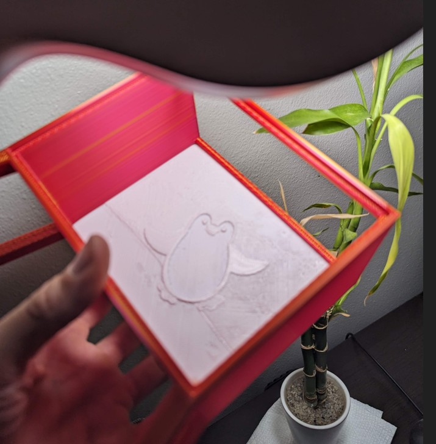
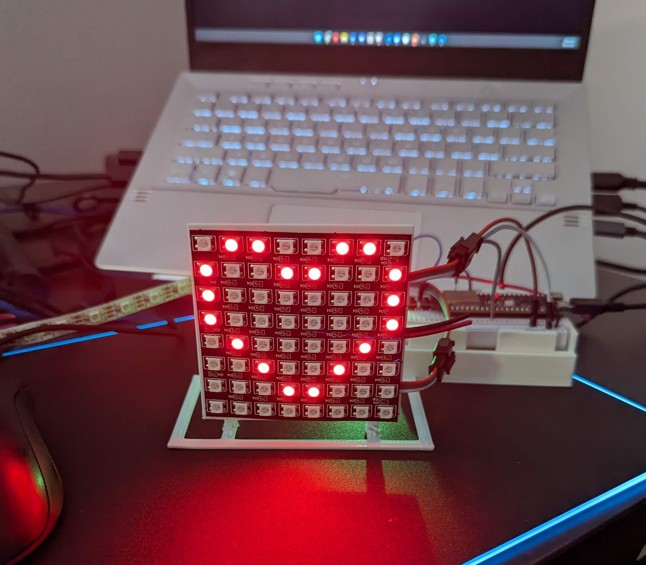
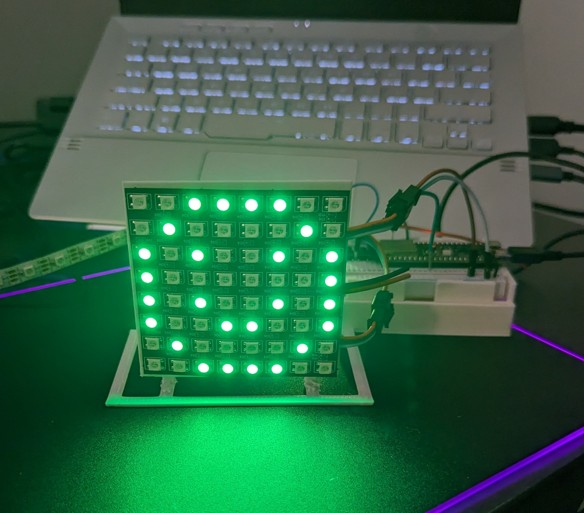

# Penguin - Personalized Message Lamp

## Overview

Penguin is a DIY project that creates a pair of interconnected **lamps** to exchange simple personalized messages. Each lamp features a **lithophane** as the display, illuminated by an 8x8 LED matrix. This project consists of two main parts:

- **ESP32 Penguin Lamp:** A **3D-printed lamp enclosure** housing an ESP32 microcontroller and an 8x8 LED matrix. The lamp face is a custom-designed **lithophane**. Users interact with the lamp by pressing a button to select a message to send.
- **Node.js Server:** A backend server built with Node.js that acts as a central communication hub. It manages message routing and storage, enabling communication between the Penguin lamps.

This project demonstrates a basic IoT (Internet of Things) communication system, combining hardware (ESP32, LEDs, 3D printing), embedded software (Arduino IDE), and backend server development (Node.js), all centered around a unique **penguin-themed message lamp**.

### Features

- **Inter-Lamp Messaging:** Allows two Penguin lamps to send and receive simple pre-defined messages to each other over a network.
- **Button-Based Message Selection:** Users send messages by pressing a button on their Penguin lamp a specific number of times to select from pre-defined messages.
- **8x8 LED Matrix Display with Lithophane:** Received messages are displayed on an 8x8 LED matrix **behind a custom lithophane**. The lithophane diffuses the LED light, creating a visually appealing display of colors and patterns that represent different messages.
- **Pre-defined Message Patterns:** The project includes a set of pre-defined message patterns (e.g., smile, heart, flower, colors) that can be easily extended or customized.
- **Node.js Backend Server:** A simple Node.js server handles message routing and storage, enabling communication between the Penguin lamps.
- **3D-Printed Lamp Enclosure:** The Penguin lamp uses a **3D-printed enclosure** designed to house the electronics and hold the **lithophane** display.

### How it Works

**Sending a Message:**

1. **Button Press Input:** A user presses a button on their Penguin lamp a certain number of times.
2. **ESP32 Message Encoding:** The ESP32 microcontroller on the lamp interprets the button presses as a specific message.
3. **Server Communication:** The ESP32 lamp sends a message to the Node.js server, indicating the selected message.
4. **Server Message Storage:** The Node.js server receives the message and stores it, associating it with the recipient lamp.

**Receiving a Message:**

1. **Periodic Server Check:** The ESP32 lamp periodically checks the Node.js server for new messages intended for it.
2. **Message Retrieval:** If a message is found for the lamp, the ESP32 retrieves the message data from the server.
3. **LED Matrix & Lithophane Display:** The ESP32 decodes the message and displays the corresponding color and pattern on the 8x8 LED matrix, which is then diffused and visualized through the **lithophane** on the lamp's face.

### Physical Supplies and Links

To build your own Penguin lamps, you will need the following hardware components:

- **Microcontroller:** ESP32 Development Board (e.g., ESP32 DevKitC V4) - [DigiKey Link to ESP32-S3-DEVKITC-1-N32R8V](https://www.digikey.com/en/products/detail/espressif-systems/ESP32-S3-DEVKITC-1-N32R8V/15970965?utm_adgroup=&utm_source=google&utm_medium=cpc&utm_campaign=PMax%20Shopping_Product_Low%20ROAS%20Categories&utm_term=&utm_content=&gclid=Cj0KCQjwusunBhCYARIsAFBsUP9LnaJD9s0TqwgHO65f_HdPA6vvaPaSplHHLiGu4rG288dLipJM4GwaAu0MEALw_wcB)
- **LED Matrix:** 8x8 Flexible LED Matrix (64 Pixels, 8cmx8cm) - [Amazon Link to 8x8 Flexible LED Matrix](https://www.amazon.com/gp/product/B0C2C6KF4Y/ref=ppx_yo_dt_b_asin_title_o00_s00?ie=UTF8&th=1)
- **3D Printed Lamp Enclosure & Lithophane:**
  - **3D Model Files (Included in Repository):** The 3D model files for the **lamp enclosure** and **lithophane insert** are provided in the `3d_models/` directory of this repository. Use these files for 3D printing:
    - `3d_models/penguin.3mf`: **Lamp enclosure model** (likely needs adaptation for 8x8 LED matrix). _(Note: While named "penguin.3mf", this file is for the lamp enclosure itself)_
    - `3d_models/litho_insert_single_merged.3mf`: **Lithophane insert** designed for the lamp face.
    - `3d_models/Lithophane_Gestell_35mm_-_Lampe_01.stl`: (Potentially a stand or frame for the lithophane or lamp - investigate if needed).
    - `3d_models/esp32-board-with-cuts.3mf`: (Potentially a mounting plate for the ESP32 inside the lamp - investigate if needed).
  - **Lithophane Creation Guide:** [Instructables - How to Make a Lithophane](https://www.instructables.com/Litophanes-How-to-3D-Print-your-photos/) (To understand the process of creating lithophanes, should you wish to design your own).
- **Button:** Tactile button for user input.
- **Wiring:** Jumper wires, breadboard or perfboard for prototyping (or PCB for permanent build).
- **Power Supply:** USB cable and power source.

### Software Requirements

- **Arduino IDE:** Download and install the Arduino IDE from [https://www.arduino.cc/en/software](https://www.arduino.cc/en/software) (Version [Specify Version if important]).
- **ESP32 Board Support for Arduino IDE:** Follow instructions to install ESP32 board support: [Link to ESP32 Arduino Core Installation Guide]\[Replace with official ESP32 Arduino core installation link]
- **Node.js and npm:** Install Node.js and npm (Node Package Manager) from [https://nodejs.org/](https://nodejs.org/) (Version [Specify Version if important]).
- **Arduino Libraries:** Install the following libraries using the Arduino Library Manager:
  - [Specify LED Matrix Library, e.g., "Adafruit NeoPixel"]
  - [Specify HTTP Client Library, e.g., "HTTPClient"]
  - _(Add any other Arduino libraries used)_
- **Node.js Dependencies:** Install Node.js server dependencies by running `npm install` in the `nodejs-server` directory (see "Running the Node.js Server" section).

### Installation and Setup Instructions

**1. 3D Print Lamp Enclosure and Lithophane:**

- Download the 3D model files from the `3d_models/` directory in this repository.
- Adapt the 3D models as needed to fit the 8x8 LED matrix and ESP32 board.
- Print the lamp enclosure and Lithophane insert using a 3D printer.
   
    _(Example of the 3D printed Penguin lamp enclosure with lithophane)_

**2. Hardware Wiring (ESP32 Lamp):**

- Wire the 8x8 LED matrix, button, and ESP32 according to your chosen wiring diagram. (Consider adding a wiring diagram image to `docs/` and referencing it here if complex).
- Ensure proper connections for power and data lines.

**3. Set up Arduino IDE and ESP32 Code:**

- Install the Arduino IDE and ESP32 board support as per the "Software Requirements."
- Install necessary Arduino libraries using the Library Manager.
- Open the `esp32_code/basic_web/basic_web.ino` file in the Arduino IDE.
- **Configure WiFi and Server Address:** Modify the `basic_web.ino` code to:
  - Enter your WiFi network SSID and password.
  - Set the IP address or hostname of your Node.js server so the ESP32 can communicate with it. _(Provide specific code lines to modify)_
- Select your ESP32 board and port in the Arduino IDE and upload the code to your ESP32 device.

**4. Set up and Run the Node.js Server:**

- Navigate to the `nodejs-server` directory in your project in a terminal.
- Install Node.js dependencies: `npm install`
- **Configure Server Settings (Optional):**
  - Review the server code (`index.ts` or `index.js`) and configure any necessary settings, such as port number or database connection (if applicable).
- Run the Node.js server: `npm run docker-compose-up` (if using Docker Compose) or `npm run start` (for local development).

**5. Assemble the Penguin Lamp:**

- Carefully place the ESP32, LED matrix, and button inside the 3D-printed lamp enclosure.
- Secure the lithophane insert in front of the LED matrix to diffuse the light. 
  
  
    _(Example of working shapes)_

### Usage Instructions

1. **Power On Devices:** Power on both the ESP32 Penguin lamp and ensure the Node.js server is running and accessible on the network.
2. **Sending a Message:** On one Penguin lamp, press the button a specific number of times to select a message. (Define message mappings in your `README.md`, e.g., "1 press = Smile, 2 presses = Heart, etc."). The lamp will send this message to the server.
3. **Receiving a Message:** The paired Penguin lamp will periodically check the server. When it detects a new message, it will retrieve it and display the corresponding pattern and color on its LED matrix, visualized through the lithophane.

### Makefile Commands

The `Makefile` in this project provides convenient commands for common development tasks:

- `make install`: Installs Node.js dependencies (`npm install`).
- `make build`: Builds the Node.js server (`npm run build`).
- `make docker-compose-up`: Builds the Node.js server and starts it using Docker Compose (`docker-compose up`).
- `make docker-build`: Builds the Docker image for the Node.js server (`docker build`).
- `make docker-run`: Runs the Docker image locally (`docker run`).
- `make docker-push`: Pushes the Docker image to a Docker registry (`docker push`).

### Contributing

Contributions to the Penguin project are welcome! Please feel free to fork this repository and submit pull requests for any improvements or new features.

### License

This project is licensed under the MIT License - see the [LICENSE](LICENSE) file for details.
